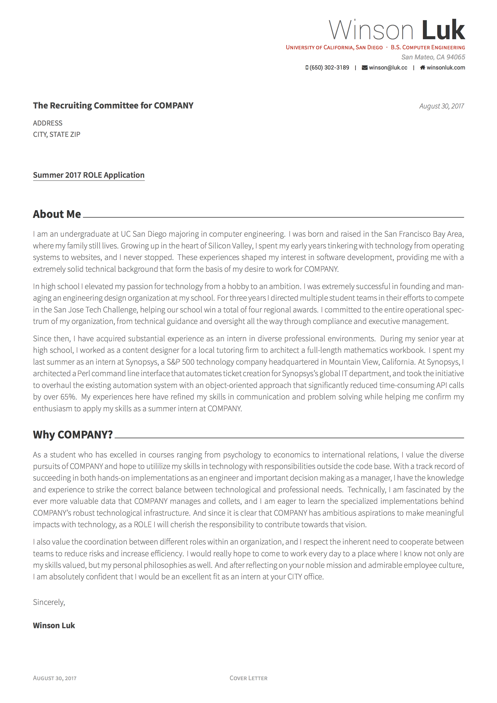
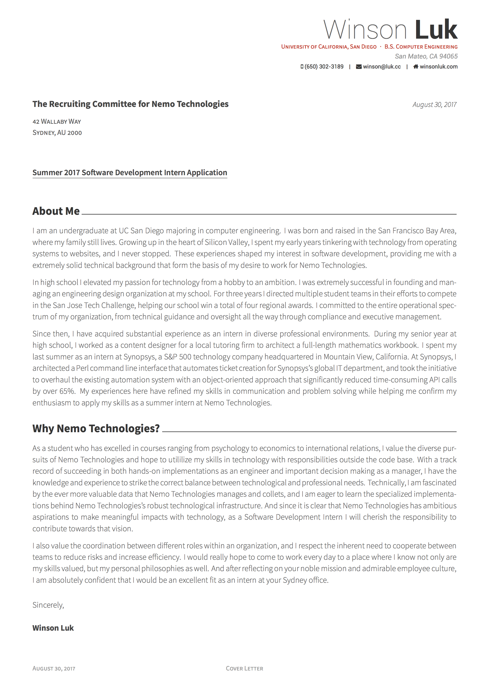

AutoApply
===

Automatically generate a customized cover letter and email for a job application. This script creates one LaTeX-formatted cover letter with an option of two emails (exploratory or applying). A Google Calendar event is available for a follow-up email. XeLaTeX, texlive-math-extra, and texlive-fonts-extra need to be preinstalled. Tested successfully with OSx and Ubuntu.

Usage Example
---
~~~
$ ./script.sh
EMAIL? (y/n): y
UCSD? (y/n): n
NAME: P. Sherman
COMPANY: Nemo Technologies
ADDRESS: 42 Wallaby Way
CITY: Sydney
STATE: AU
ZIP: 2000
ROLE: Software Development Intern
~~~

Date and time of day are automatically calculated from the `date` command,
for use in salutation (Good morning/afternoon/evening) and follow-up email
scheduling. The default is a Tuesday 3-10 days from the script execution
(Tuesday is the day of the week on which people are statistically most likely
to respond to cold emails).

Before
===

Email (from shell output)
---

#### Email for Applying (UCSD=n)
>SUBJECT: Summer internship opportunities
>
>Good TIME NAME,
>
>My name is Winson Luk, and I am currently an undergraduate at UC San Diego studying computer engineering. I am genuinely interested in gaining practical experience at COMPANY, and I believe that I would be an excellent fit in any team that is in need of a summer intern.
>
>I am aware of the opportunities articulated on your website, and I wanted to take the initiative of contacting you directly for recruitment. I have attached my resume and cover letter for consideration, and you may visit my website at winsonluk.com to learn more about my skills, projects, and passions.
>
>Please let me know if there is a convenient time to briefly interview for potential internship opportunities over the summer. I look forward to hearing back from you soon.
>
>I look forward to hearing back from you soon. I'm sure you have a busy schedule, so I'll provide a follow up email on Tuesday DAY in case this one is missed.
>
>Regards,
>Winson

#### Email for Networking (UCSD=y)
>SUBJECT: UCSD student reaching out
>
>Good TIME NAME,
>
>My name is Winson Luk, and I am currently an undergraduate at UC San Diego studying computer engineering. While exploring opportunities in the software industry, I came across your details on SOURCE and wanted to get in touch.
>
>If you have a few minutes sometime, I would love to hear about your path from UCSD to COMPANY. I hope to find out what I can do to succeed as a developer and gain practical experience even as a student.
>
>Please let me know if there is a convenient time to briefly chat about your experiences and achievements in the field. I would especially appreciate any feedback on my resume or pointers to teams in need of a summer intern.
>
>Thank you for your consideration. I'm sure you have a busy schedule, so I'll provide a follow up email on Tuesday DAY in case this one is missed.
>
>I look forward to hearing back from you soon.
>
>Thank you,
>Winson

#### Schedule a follow-up email (copy into Google Calendar Quick Add)
>  CALENDAR: Email NAME from COMPANY on DAY.

Cover Letter (from output/coverletter.pdf)
---

After
===

Email (from shell output)
---

#### Email for Applying (UCSD=n)
>SUBJECT: Summer internship opportunities
>
>Good evening P. Sherman,
>
>My name is Winson Luk, and I am currently an undergraduate at UC San Diego studying computer engineering. I am genuinely interested in gaining practical experience at Nemo Technologies, and I believe that I would be an excellent fit in any team that is in need of a summer intern.
>
>I am aware of the opportunities articulated on your website, but I wanted to take the initiative of contacting you directly for recruitment. I have attached my resume and cover letter for consideration, and you may visit my website at winsonluk.com to learn more about my skills, projects, and passions.
>
>Please let me know if there is a convenient time to briefly interview for potential internship opportunities over the summer.
>
>I look forward to hearing back from you soon. I'm sure you have a busy schedule, so I'll provide a follow up email on Tuesday 2/28 in case this one is missed.
>
>Regards,
>
>Winson

#### Email for Networking (UCSD=y)

>SUBJECT: UCSD student reaching out
>
>Good evening P. Sherman,
>
>My name is Winson Luk, and I am currently an undergraduate at UC San Diego studying computer engineering. While exploring opportunities in the software industry, I came across your details on LinkedIn and wanted to get in touch.
>
>If you have a few minutes sometime, I would love to hear about your path from UCSD to Nemo Technologies. I hope to find out what I can do to succeed as a developer and gain practical experience even as a student.
>
>Please let me know if there is a convenient time to briefly chat about your experiences and achievements in the field. I would especially appreciate any feedback on my resume or pointers to teams in need of a summer intern.
>
>Thank you for your consideration. I'm sure you have a busy schedule, so I'll provide a follow up email on Tuesday 2/28 in case this one is missed.
>
>I look forward to hearing back from you soon.
>
>Thank you,
>
>Winson

#### Schedule a follow-up email (copy into Google Calendar Quick Add)
>  CALENDAR: Email P. Sherman from Nemo Technologies on 2/28

Cover Letter (from output/coverletter.pdf)
---

